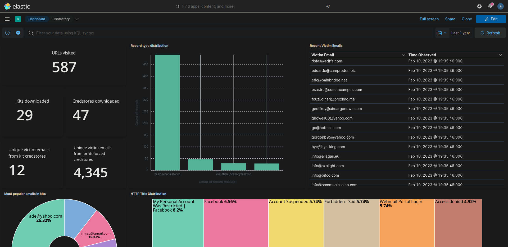

# Fishfactory

Fishfactory is a utility for extracting intelligence from phishing URLs. Fishfactory is intended to automate the low hanging fruit intelligence pivots for credential phishing infrastructure ([T1566.002](https://attack.mitre.org/techniques/T1566/002/) + [T1078](https://attack.mitre.org/techniques/T1078/)) to give users insight into the mechanics and scope of phishing attacks impacting them. 

Fishfactory is currently in a functional prototype stage. 

# Features

- Standard functions:
	- conducts post-JavaScript execution reconnaissance of lure pages to obtain a screenshot and basic details such as SSL certificate and favicon
	- walks back phishing URLs to find open directories and ZIP phishing kits
		- processes files in kits to identify PHP mailers, direct writes to credential stores and Telegram bots
			- downloads any credential stores found & processes victim emails
	- runs a naive credential store finder against targets to look for common credential stores locations & processes victim emails from any credential stores found
	- facilitates easy bulk inputs and transportation of documents to Elasticsearch
- Additional, optional functions for special cases:
	- for phishing infrastructure delivered via IPFS web gateways, uses [IPFSEnricher](https://github.com/oj-sec/IPFSEnricher) to identify the IP addresses pushing the phishing content content to the IPFS network as additional IOCs
	- for phishing infrastructure behind Cloudflare, attempts to obtain candidates for the true IP address by querying the Shodan API for hosts bearing the same favicon and/or SSL certificate. Returns results if there are five or less hosts bearing the identifier. Requires a Shodan API key 

# Installation

Fishfactory is intended to be deployed via the included docker-compose file & prebuilt containers.  

Pull the repository and run ```docker-compose up``` in the project directory. 

The Fishfactory API will start listening on `localhost:5000`. The API's main endpoint,  `/fishfactory/submit_url`,  consumes a POSTed JSON dictionary and uses the value of key "url" as the target URL.

A rudimentary webUI is also served at `/fishfactory`.

# Usage

Use the ```fishfactory.py``` script to interact with the Fishfactory web service:

- Process a single URL using `python3 fishfactory.py -u "http://definitelynotmalicious.live"`
- Read URLs from a newline delimited file using `python3 fishfactory.py -f inputfile.txt`

Optional parameters are:

- `-t [TLP]`, `--tlp [TLP]` add a [TLP designation](https://www.cisa.gov/tlp) to the record(s) produced. Accepts TLP 2.0 values `RED`, `AMBER+STRICT`, `AMBER`, `GREEN` and `CLEAR`.
- `-e`, `--elastic` send results to Elasticsearch (see below)

Alternatively, submit a single URL at a time via the webUI. No result forwarding is available for the webUI. 

# Outputs

`fishfactory.py` will output results to stdout by default, but will optionally also forward results to your Elasticsearch instance if the `-e` flag is passed.

If you intend to use Elasticsearch, generate a configuration file using the interactive prompt via `python3 fishfactory.py -c`. You will need to specify your Elasticsearch API key and instance (including index endpoint) URI. The configuration file can also be used to specify a custom location for the Fishfactory API and provide your Shodan API key. Both features are included in the interactive prompt.

Fishfactory will write file-based outputs to the `./kits`, `./credstores` and `./images` directories on the host via shared volumes. Note that these files will be owned by root as per normal docker behavior.  

# Planned features

- sample Kibana dashboard
- improving Cloudflare deanonymisation techniques
- enriching details obtained from Telegram bots via the Telegram API
- attempting to identify adversary-in-the-middle and related, sophisticated phishing techniques
- machine learning image classification on lure screenshots
